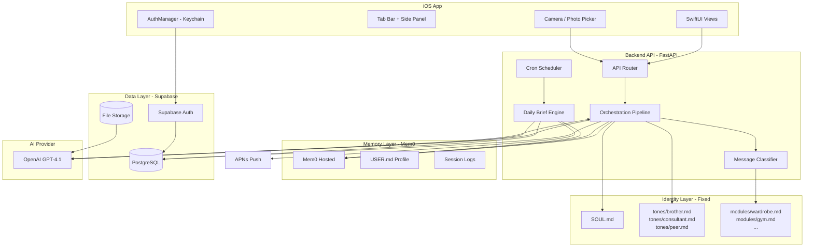

# Architecture: Noxis

---

**Version:** 1.0
**Updated:** 2026-03-18
**Project:** noxis

---

## Tech Stack

| Layer | Technology | Rationale |
|-------|-----------|-----------|
| **iOS App** | Swift + SwiftUI (iOS 17+) | Native performance, full UIKit interop for custom glass effects, AVFoundation for camera |
| **Backend API** | Python 3.12 + FastAPI | Async-first, OpenAI/Mem0 SDKs are Python-native, clean type hints via Pydantic |
| **Database & Auth** | Supabase (PostgreSQL + Auth + Storage) | Single platform for relational data, user authentication, and file storage (outfit photos, meal images) |
| **Memory Layer** | Mem0 (hosted) | Structured memory with metadata, Python SDK, free credits for early stage — eliminates custom vector store logic |
| **AI Provider** | OpenAI GPT-4.1 (multimodal) | Vision capability for outfit/meal/body checks + strong reasoning for SOUL.md personality; model ID configurable |
| **Push Notifications** | APNs via Supabase Edge Functions | Daily brief push at configured time; Supabase Edge Functions handle cron scheduling |
| **Hosting** | Railway (FastAPI backend) + Supabase (data) | PaaS simplicity, fast deploys, low ops overhead for early stage |

---

## System Architecture



---

## Orchestration Pipeline (Core Flow)

Every chat message follows this exact sequence:

```
1. Receive message (text + optional image)
        ↓
2. classifyMessage() → { primaryModule, secondaryModule?, confidence }
        ↓
3. retrieveMemory(userId, module, query) → Mem0 → raw memories[]
        ↓
4. applyDecisionPolicy(memories[]) → filtered memories[] (max 20, relevance + quality filtered)
        ↓
5. buildSystemPrompt(SOUL.md + toneMode + moduleContext + filteredMemories)
        ↓
6. callOpenAI(systemPrompt, conversationHistory, userMessage, imageBase64?)
        ↓
7. streamResponse() → SSE tokens → iOS app
        ↓
8. extractMemoryCandidates(exchange) → storeToMem0() [async, non-blocking]
        ↓
9. extractDashboardData(exchange) → writeToSupabase() [async, non-blocking]
```

Steps 8 and 9 run async after the response is delivered — they never block the user experience.

---

## Data Model

### Supabase — Core Tables

```sql
-- Users (extends Supabase Auth)
users (
  id          UUID PRIMARY KEY REFERENCES auth.users,
  tone_mode   TEXT CHECK (tone_mode IN ('brother', 'consultant', 'peer')),
  brief_time  TIME DEFAULT '07:00',
  brief_enabled BOOLEAN DEFAULT true,
  onboarding_complete BOOLEAN DEFAULT false,
  created_at  TIMESTAMPTZ DEFAULT now()
)

-- Conversation Threads
threads (
  id          UUID PRIMARY KEY,
  user_id     UUID REFERENCES users(id),
  title       TEXT,          -- auto-generated from first message
  created_at  TIMESTAMPTZ DEFAULT now(),
  updated_at  TIMESTAMPTZ DEFAULT now()
)

-- Messages
messages (
  id          UUID PRIMARY KEY,
  thread_id   UUID REFERENCES threads(id),
  role        TEXT CHECK (role IN ('user', 'assistant')),
  content     TEXT,
  image_url   TEXT,          -- Supabase Storage URL if image attached
  module      TEXT,          -- classified module for this message
  created_at  TIMESTAMPTZ DEFAULT now()
)

-- Daily Briefs
daily_briefs (
  id          UUID PRIMARY KEY,
  user_id     UUID REFERENCES users(id),
  date        DATE,
  content     TEXT,          -- full brief markdown
  viewed_at   TIMESTAMPTZ,   -- null = unread
  created_at  TIMESTAMPTZ DEFAULT now(),
  UNIQUE (user_id, date)
)

-- Module Data (one row per module per user)
wardrobe_items (
  id          UUID PRIMARY KEY,
  user_id     UUID REFERENCES users(id),
  name        TEXT,
  category    TEXT,
  image_url   TEXT,
  notes       TEXT,
  source      TEXT CHECK (source IN ('manual', 'chat')),
  created_at  TIMESTAMPTZ DEFAULT now()
)

workout_logs (
  id          UUID PRIMARY KEY,
  user_id     UUID REFERENCES users(id),
  date        DATE,
  type        TEXT,          -- Push/Pull/Legs/Upper/Lower/Cardio/Other
  notes       TEXT,
  source      TEXT CHECK (source IN ('manual', 'chat')),
  created_at  TIMESTAMPTZ DEFAULT now()
)

meal_logs (
  id          UUID PRIMARY KEY,
  user_id     UUID REFERENCES users(id),
  date        DATE,
  description TEXT,
  image_url   TEXT,
  delivery    BOOLEAN DEFAULT false,
  notes       TEXT,
  source      TEXT CHECK (source IN ('manual', 'chat')),
  created_at  TIMESTAMPTZ DEFAULT now()
)

purchase_logs (
  id          UUID PRIMARY KEY,
  user_id     UUID REFERENCES users(id),
  date        DATE,
  item        TEXT,
  amount      DECIMAL(10,2),
  category    TEXT,          -- Clothing/Food/Fitness/Entertainment/Other
  quality_tag TEXT,          -- compounding/numbing/neutral (Noxis-assessed)
  source      TEXT CHECK (source IN ('manual', 'chat')),
  created_at  TIMESTAMPTZ DEFAULT now()
)

habits (
  id          UUID PRIMARY KEY,
  user_id     UUID REFERENCES users(id),
  name        TEXT,
  source      TEXT CHECK (source IN ('manual', 'noxis')),
  created_at  TIMESTAMPTZ DEFAULT now()
)

habit_completions (
  id          UUID PRIMARY KEY,
  habit_id    UUID REFERENCES habits(id),
  date        DATE,
  created_at  TIMESTAMPTZ DEFAULT now(),
  UNIQUE (habit_id, date)
)
```

---

## Memory Layer — Mem0

### Memory Entry Schema
```python
{
  "user_id": str,
  "content": str,           # the memory text
  "category": str,          # wardrobe | gym | food | spending | routines | social | general
  "memory_type": str,       # fact | preference | pattern | decision
  "confidence": float,      # 0.0 - 1.0
  "source": str,            # chat | onboarding | manual
  "created_at": str,        # ISO timestamp
  "updated_at": str
}
```

### Decision Policy Implementation
```python
def apply_decision_policy(memories: list, module: str, query: str) -> list:
    # 1. Relevance filter — module match + semantic similarity
    relevant = [m for m in memories if m.category == module or m.category == 'general']

    # 2. Recency weight — behavioral patterns decay, facts don't
    def recency_score(m):
        if m.memory_type == 'fact':
            return 1.0  # no decay
        days_old = (now() - m.updated_at).days
        return max(0.1, 1.0 - (days_old / 90))  # decay over 90 days

    # 3. Quality filter — confidence threshold
    qualified = [m for m in relevant if m.confidence >= 0.5]

    # 4. Sort by composite score, cap at 20
    scored = sorted(qualified, key=lambda m: m.confidence * recency_score(m), reverse=True)
    return scored[:20]
```

---

## Identity Layer — File Structure

```
backend/
  identity/
    SOUL.md              ← fixed, versioned, loaded as system prompt
    tones/
      brother.md         ← Sharp Older Brother register + vocabulary rules
      consultant.md      ← High-End Consultant register + vocabulary rules
      peer.md            ← Confident Peer register + vocabulary rules
    modules/
      wardrobe.md        ← judgment rules + memory read/write spec
      gym.md
      food.md
      spending.md
      routines.md
      social.md
      general.md
    boundaries/
      therapy.md         ← in-character redirect per tone mode
      medical.md
      legal.md
      political.md
```

### System Prompt Assembly
```python
def build_system_prompt(tone_mode: str, module: str, memories: list) -> str:
    soul = load_file("identity/SOUL.md")
    tone = load_file(f"identity/tones/{tone_mode}.md")
    module_ctx = load_file(f"identity/modules/{module}.md")
    memory_ctx = format_memories(memories)

    return f"""
{soul}

## Active Tone Mode: {tone_mode}
{tone}

## Active Module: {module}
{module_ctx}

## What I Know About This User
{memory_ctx}
""".strip()
```

---

## Daily Brief Engine

```
Server cron (Supabase Edge Function) → runs per user at their brief_time:

1. Load last 7 days of session logs from Mem0
2. Load current module states from Supabase (streak counts, recent items)
3. Load USER.md goals from Mem0
4. Assemble brief context
5. Call OpenAI GPT-4.1:
   - System: SOUL.md + active tone mode
   - Prompt: "Generate a morning brief following AGENTS.md template.
              Context: {session_logs} {module_states} {user_goals}
              Rules: specific to this user, max 3 action items,
              include one curated content recommendation relevant
              to their primary focus area."
6. Store result to daily_briefs table
7. Send APNs push notification: "Your morning brief is ready."
```

---

## API Routes

```
POST   /auth/register          # email + password → JWT
POST   /auth/login             # email + password → JWT
POST   /auth/apple             # Apple identity token → JWT
DELETE /auth/account           # delete user + all data

GET    /user/profile           # USER.md + settings
PATCH  /user/profile           # update tone, brief_time, brief_enabled

POST   /chat/message           # send message → SSE stream response
GET    /chat/threads           # list conversation threads
GET    /chat/threads/{id}      # get thread messages (paginated)
DELETE /chat/threads/{id}      # delete thread

GET    /modules/wardrobe       # wardrobe items + outfit log
POST   /modules/wardrobe       # add item manually
DELETE /modules/wardrobe/{id}  # delete item

GET    /modules/gym            # workout log + streak
POST   /modules/gym            # log workout manually

GET    /modules/food           # meal log + patterns
POST   /modules/food           # log meal manually

GET    /modules/spending       # purchase log + categories
POST   /modules/spending       # log purchase manually

GET    /modules/routines       # habits + streaks
POST   /modules/routines       # add habit
POST   /modules/routines/{id}/complete  # mark habit done today

GET    /briefs/today           # today's brief
GET    /briefs                 # brief history (last 30 days)
PATCH  /briefs/{id}/viewed     # mark brief as viewed

GET    /memory                 # list user memories grouped by category
DELETE /memory/{id}            # delete a memory
```

---

## Non-Functional Requirements

| Requirement | Target |
|-------------|--------|
| Chat response time (first token) | < 1.5 seconds |
| Image upload + classification | < 3 seconds |
| Daily brief generation | < 10 seconds (server-side, user doesn't wait) |
| API uptime | 99.5% |
| Memory retrieval latency | < 500ms |
| Image storage max size | 10MB per image (compressed to 2MB before Supabase upload) |
| Concurrent users (v1 target) | Support 500 concurrent users without degradation |
| Data encryption | All user data encrypted at rest (Supabase default) + in transit (HTTPS/TLS) |
| JWT expiry | 7 days; silent refresh; force re-auth on refresh failure |
| SOUL.md version tracking | SHA-256 hash logged per API call for drift detection |

---

## Project Structure

```
Noxis/                          ← iOS app
  Noxis.xcodeproj/
  Noxis/
    App/
      NoxisApp.swift
      AppRouter.swift
    DesignSystem/
      DesignSystem.swift        ← tokens, colors, typography
      Components/               ← GlassCard, GlassButton, etc.
    Features/
      Onboarding/
      Chat/
      Modules/
      Daily/
      Profile/
    Managers/
      AuthManager.swift
      OnboardingManager.swift
    Network/
      APIClient.swift
      SSEClient.swift           ← streaming response handler

backend/                        ← FastAPI backend
  main.py
  routers/
    auth.py
    chat.py
    modules.py
    briefs.py
    memory.py
  services/
    orchestration.py            ← 8-step pipeline
    classifier.py
    memory_service.py           ← Mem0 wrapper + decision policy
    brief_service.py
    extraction.py               ← chat → memory + dashboard
  identity/
    SOUL.md
    tones/
    modules/
    boundaries/
  schemas/
    user.py
    chat.py
    modules.py
  supabase/
    migrations/                 ← SQL migration files
```

---

## Open Questions — Resolved

| # | Question | Decision |
|---|----------|---------|
| 1 | AI provider | OpenAI GPT-4.1 (multimodal) — model ID in config, swappable |
| 2 | Memory layer | Mem0 hosted — free credits, Python SDK, no custom build |
| 3 | Backend language | Python 3.12 + FastAPI |
| 4 | Monetization | Free for now — add subscription post-PMF |
| 5 | Curated content source | AI-generated by GPT-4.1 within the brief generation call |
| 6 | Offline capability | Fully online — offline support deferred to v2 |
| 7 | Push notification strategy | Daily brief notification at user-configured time |
| 8 | Backend hosting | Railway (FastAPI) + Supabase (data + auth + storage + cron) |

---

## Change Log

| Date | Version | Author | Change |
|------|---------|--------|--------|
| 2026-03-18 | 1.0 | — | Created — all open questions resolved |
