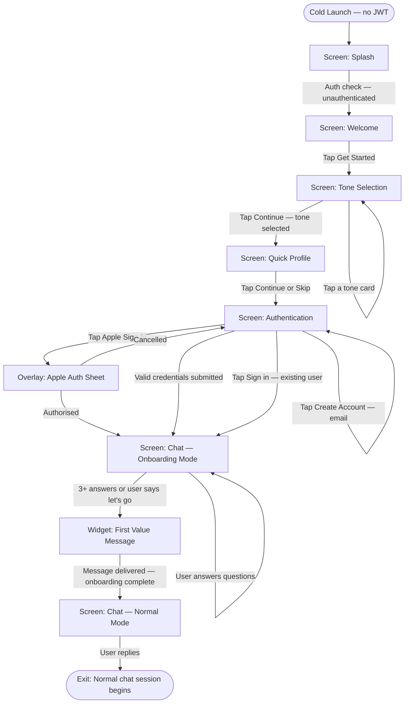

# User Flow: Onboarding

---

**ID:** UF-001
**Project:** noxis
**Epic:** E-001, E-002, E-007
**Persona:** The Invisible Man — new user, no prior context, arriving from App Store
**Status:** Draft
**Stage:** Draft
**Created:** 2026-03-18
**Updated:** 2026-03-18
**Version:** 1.0

---

## Overview

Covers the complete journey from first app launch through account creation, tone selection, quick profile setup, and conversational onboarding — ending with first value delivery in chat. The flow is hybrid: two polished visual screens set expectations and collect key preferences, then the experience transitions into chat where Noxis completes setup conversationally. By the end, the user has received one specific, personalized recommendation without having to ask for it.

Multi-epic: the app shell (E-007) provides the screens and navigation container; identity engine (E-002) powers the first Noxis responses; onboarding logic (E-001) orchestrates the flow.

## Entry Point

- Cold app launch — unauthenticated user (no JWT in Keychain)

## Stories Covered

- S-007-004 — App Launch & Splash Screen
- S-001-001 — Welcome & Tone Selection Screens
- S-001-002 — Quick Profile Screen
- S-001-005 — Authentication
- S-001-003 — Conversational Onboarding in Chat
- S-001-004 — First Value Delivery
- S-002-001 — Load SOUL.md as Fixed System Prompt
- S-002-002 — Implement Tone Mode Selection & Switching

## Flow

## Screens

### Screen: Splash

- **Purpose:** Hold the premium brand impression during the auth state check on launch
- **Key content:** Pure black background; Noxis wordmark centered (SF Pro Display Bold, 28pt, white); no animation, no spinner
- **Primary action:** None — purely transitional
- **Transitions:**
  - Auth check passes (no JWT) → Screen: Welcome
  - Auth check passes (valid JWT) → Screen: Chat or Screen: Daily (per time of day)
- **Stories:** S-007-004

### Screen: Welcome

- **Purpose:** First brand impression — communicate what Noxis is and get the user moving
- **Key content:** Noxis wordmark; tagline "Your standards, elevated."; single CTA "Get Started" (glass button, accent border)
- **Primary action:** Tap "Get Started"
- **Transitions:**
  - `Get Started` → Screen: Tone Selection
- **Stories:** S-001-001

### Screen: Tone Selection

- **Purpose:** Let the user choose how Noxis talks to them before anything else — sets the tone for the entire experience
- **Key content:** Header "How should I talk to you?"; three glass cards (Brother / Consultant / Peer), each with mode name, one-line description, and a sample Noxis response; selected card shows accent glow border; "Continue" button (disabled until selection made); footnote "You can change this anytime in settings"
- **Primary action:** Tap a tone card to select, then tap Continue
- **Transitions:**
  - `Tap card` → card highlights; Continue button activates
  - `Continue` → Screen: Quick Profile (selection stored to OnboardingState)
- **Stories:** S-001-001, S-002-002

### Screen: Quick Profile

- **Purpose:** Seed basic context before chat so Noxis's opening message is specific, not generic
- **Key content:** Header "Quick setup"; subtext "Takes 20 seconds. Skip anytime."; three pill-selector questions (Primary Focus, Fitness Level, Cooking Habit); Continue button; Skip link
- **Primary action:** Tap pill options then Continue (or Skip)
- **Transitions:**
  - `Continue` → Screen: Authentication (selections stored to OnboardingState)
  - `Skip` → Screen: Authentication (no selections stored)
- **Stories:** S-001-002

### Screen: Authentication

- **Purpose:** Save the user's setup — account creation gates all persistent features
- **Key content:** Header "Save your setup"; subtext "Create an account so Noxis can remember everything."; Apple Sign-In button (native); Email field + Password field + "Create account" CTA; "Already have an account? Sign in" link
- **Primary action:** Sign in with Apple or create email account
- **Transitions:**
  - `Apple Sign-In` → Overlay: Apple Auth Sheet
  - `Create account (valid)` → Screen: Chat — Onboarding Mode
  - `Sign in (existing)` → Screen: Chat — Normal Mode (skips onboarding)
  - `Submit (duplicate email)` → inline error: "An account with this email already exists. Sign in instead."
- **Stories:** S-001-005

### Overlay: Apple Auth Sheet

- **Purpose:** Native iOS Apple Sign-In authorization sheet
- **Key content:** Standard iOS Apple auth sheet — app name, account to use, Continue button, Cancel
- **Primary action:** Tap Continue to authorize
- **Transitions:**
  - `Authorised` → overlay dismissed; Screen: Chat — Onboarding Mode
  - `Cancelled` → overlay dismissed; Screen: Authentication restored
- **Stories:** S-001-005

### Screen: Chat — Onboarding Mode

- **Purpose:** Complete setup conversationally — prove the product works before the user has asked anything
- **Key content:** Standard chat interface; Noxis sends opening message automatically on screen mount (in selected tone mode, referencing Quick Profile selections if any); user answers 3-5 questions naturally; no form UI — pure conversation
- **Primary action:** Respond to Noxis's questions; send a style photo if prompted
- **Transitions:**
  - `3+ answers received OR user sends "let's go"` → Widget: First Value Message fires
  - `User sends unrelated question` → Noxis answers it, gently redirects back to onboarding context once
- **Stories:** S-001-003, S-002-001, S-002-002

### Widget: First Value Message

- **Purpose:** Prove Noxis is useful before the user has had to ask — the product's "aha moment"
- **Key content:** Noxis message (no user prompt) — one specific, actionable recommendation based on onboarding context; follow-up: "What's your reaction? And feel free to ask me anything — that's what I'm here for."
- **Primary action:** Read the recommendation; respond or start asking questions
- **Transitions:**
  - `Message delivered` → onboarding complete flag set; Screen: Chat — Normal Mode active
- **Stories:** S-001-004

### Screen: Chat — Normal Mode

- **Purpose:** The ongoing chat experience — all subsequent sessions start here (or Daily tab in the morning)
- **Key content:** Full chat interface; conversation history visible; Noxis responds to anything; tab bar accessible
- **Primary action:** Continue chatting
- **Transitions:**
  - Normal chat session → see UF-002
- **Stories:** S-004-001

---

## Exit Points

- **Success:** User reaches Chat — Normal Mode with first value delivered. Onboarding flag set to complete. USER.md seeded with tone, profile data, and first memory entries.
- **Partial (skip):** User skips Quick Profile and/or minimal onboarding answers → first value delivery uses fallback message; USER.md seeded with tone only.
- **Existing user (sign in):** Auth screen → Chat — Normal Mode directly; onboarding skipped entirely.
- **Error (auth failure):** Network error on account creation → error toast; form preserved; user retries.

---

## Change Log

| Date | Version | Author | Change |
|------|---------|--------|--------|
| 2026-03-18 | 1.0 | — | Created |
