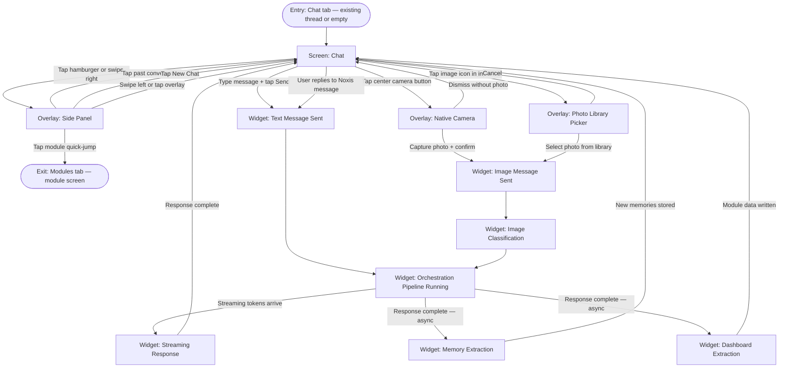

# User Flow: Chat & Image Check

---

**ID:** UF-002
**Project:** noxis
**Epic:** E-002, E-003, E-004, E-007
**Persona:** The Upgrader — returning user, wants instant judgment on an outfit or life decision
**Status:** Draft
**Stage:** Draft
**Created:** 2026-03-18
**Updated:** 2026-03-18
**Version:** 1.0

---

## Overview

The core daily loop. Covers every way a user interacts with Noxis through chat: sending a text message, sending an image via the center camera button or inline photo picker, receiving a streamed response, and browsing past conversations via the side panel. This is the primary value surface — every other feature (modules, daily brief) feeds back into or extends this flow.

Multi-epic: the shell (E-007) provides navigation; identity engine (E-002) powers responses; memory (E-003) personalises them; chat (E-004) handles the interface and pipeline.

## Entry Point

- App opens to Chat tab (returning user, post-onboarding, after 10am)
- Or: user taps Chat tab from any other tab

## Stories Covered

- S-004-001 — Chat Interface — Send & Receive Messages
- S-004-002 — Image Input — Camera Button & Photo Send
- S-004-003 — Image Classification & Module-Aware Judgment
- S-004-004 — Conversation History & Thread Management
- S-004-005 — Orchestration Pipeline
- S-004-006 — Streaming Response Display
- S-007-001 — Bottom Tab Bar
- S-007-002 — Side Panel
- S-003-003 — Memory Extraction from Chat
- S-003-004 — Decision Policy Filtering
- S-005-007 — Chat-to-Dashboard Extraction Pipeline

## Flow

## Screens

### Screen: Chat

- **Purpose:** Primary interaction surface — where the user talks to Noxis and receives judgment, advice, and feedback
- **Key content:**
  - Navigation bar: Noxis wordmark (center); hamburger icon (top-left opens Side Panel)
  - Message list: scrollable, auto-scrolls to latest; user messages right-aligned glass bubble; Noxis messages left-aligned, no bubble background, text only
  - Empty state (new thread): "Ask me anything." centered in muted text
  - Input bar (pinned to bottom, above keyboard): text field (glass input), image icon (left of field), send button (right of field, active when text present)
  - Typing indicator: three animated dots while Noxis response is streaming
- **Primary action:** Type a message and send, or tap camera/image for photo input
- **Transitions:**
  - `Hamburger / swipe right` → Overlay: Side Panel
  - `Send text` → Widget: Text Message Sent → pipeline
  - `Camera button (tab bar center)` → Overlay: Native Camera
  - `Image icon (input bar)` → Overlay: Photo Library Picker
- **Stories:** S-004-001, S-004-006

### Overlay: Side Panel

- **Purpose:** Access conversation history and navigate to modules without leaving the chat flow
- **Key content:**
  - Header: Noxis wordmark + close (×) button
  - "New Chat" button
  - Conversation list grouped by date (Today / Yesterday / This Week / Older); each entry shows truncated first user message + timestamp
  - "Modules" section with 5 module quick-jump buttons (Wardrobe / Gym / Food / Spending / Routines)
  - Empty state: "Your conversations will appear here"
- **Primary action:** Tap a past conversation or start a new one
- **Transitions:**
  - `Tap conversation` → panel closes; Chat loads that thread
  - `New Chat` → panel closes; fresh empty thread
  - `Module quick-jump` → panel closes; Modules tab opens to that module
  - `Tap overlay / swipe left / × button` → panel closes; Chat restored
- **Stories:** S-007-002, S-004-004

### Overlay: Native Camera

- **Purpose:** Zero-friction photo capture for outfit/meal/body checks from anywhere in the app
- **Key content:** Native iOS camera in photo mode; standard iOS capture controls
- **Primary action:** Capture photo and confirm
- **Transitions:**
  - `Capture + confirm` → overlay dismissed; photo sent as message → Widget: Image Message Sent
  - `Dismiss without photo` → overlay dismissed; Chat restored with no change
- **Stories:** S-004-002, S-007-001

### Overlay: Photo Library Picker

- **Purpose:** Send a photo from the library (e.g., an outfit from earlier today or a saved reference image)
- **Key content:** Native iOS PHPickerViewController; single-select photo mode
- **Primary action:** Select a photo
- **Transitions:**
  - `Select photo` → picker dismissed; photo sent as message → Widget: Image Message Sent
  - `Cancel` → picker dismissed; Chat restored
- **Stories:** S-004-002

### Widget: Text Message Sent

- **Purpose:** Display the user's message in the chat and trigger the pipeline
- **Key content:** User message bubble (right-aligned, glass card); sent timestamp
- **Primary action:** None — triggers pipeline automatically
- **Transitions:**
  - `Automatic` → Widget: Orchestration Pipeline Running
- **Stories:** S-004-001

### Widget: Image Message Sent

- **Purpose:** Display the sent photo as a message bubble and trigger classification + pipeline
- **Key content:** User message bubble containing the image thumbnail (right-aligned); image tap opens full-screen preview
- **Primary action:** None — triggers classification automatically
- **Transitions:**
  - `Automatic` → Widget: Image Classification → Widget: Orchestration Pipeline Running
- **Stories:** S-004-002

### Widget: Image Classification

- **Purpose:** Identify what the image shows so the right judgment framework is applied
- **Key content:** Not visible to user — background process; classifies as wardrobe / food / gym / environment / other
- **Primary action:** None — automatic
- **Transitions:**
  - `Classification complete` → Widget: Orchestration Pipeline Running (with module context set)
- **Stories:** S-004-003

### Widget: Orchestration Pipeline Running

- **Purpose:** Assemble the full response context and call OpenAI — the invisible core of the product
- **Key content:** Typing indicator visible in chat while pipeline runs (three animated dots under Noxis avatar)
- **Primary action:** None — automatic
- **Pipeline steps (invisible to user):**
  1. Retrieve relevant memories from Mem0
  2. Apply decision policy (relevance + quality filter, max 20 memories)
  3. Build system prompt: SOUL.md + tone mode + module context + filtered memories
  4. Call OpenAI GPT-4.1 (with image if present)
  5. Stream response tokens
- **Transitions:**
  - `First token arrives` → typing indicator replaced by Widget: Streaming Response
- **Stories:** S-004-005, S-003-004

### Widget: Streaming Response

- **Purpose:** Display Noxis's response as it streams in — fast, alive, premium feel
- **Key content:** Noxis response text appearing word-by-word (left-aligned, no bubble); cursor blink at end of incomplete text; response completes and cursor disappears
- **Primary action:** Read the response
- **Transitions:**
  - `Response complete` → Chat input bar re-activates; async: Widget: Memory Extraction + Widget: Dashboard Extraction fire
  - `Stream interrupted` → partial response shown + "Continue" tap option at end
- **Stories:** S-004-006

### Widget: Memory Extraction

- **Purpose:** Silently store new facts, preferences, and decisions from the exchange to Mem0
- **Key content:** Not visible to user — background async process
- **Primary action:** None — automatic
- **Transitions:**
  - `Complete` → Mem0 updated; no UI change
- **Stories:** S-003-003

### Widget: Dashboard Extraction

- **Purpose:** Write structured module data (wardrobe item, workout, meal, purchase, habit) to Supabase from chat
- **Key content:** Not visible to user — background async process
- **Primary action:** None — automatic
- **Transitions:**
  - `Complete` → relevant module data updated in dashboard (user will see it next time they open Modules tab)
- **Stories:** S-005-007

---

## Exit Points

- **Continue chatting:** User replies → flow loops back through text message → pipeline → response
- **Switch tab:** User taps any tab bar item → Chat session preserved; returns to same position when Chat tab re-selected
- **Open module from side panel:** Exits to Modules tab at the selected module
- **Error (API failure):** Pipeline fails → inline error message in chat: "Something went wrong. Tap to retry." — conversation history preserved

---

## Change Log

| Date | Version | Author | Change |
|------|---------|--------|--------|
| 2026-03-18 | 1.0 | — | Created |
